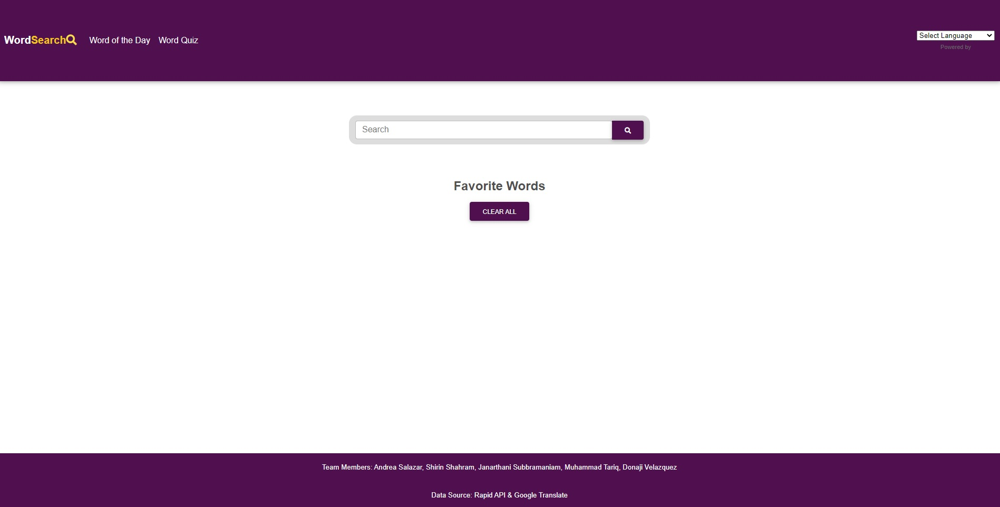
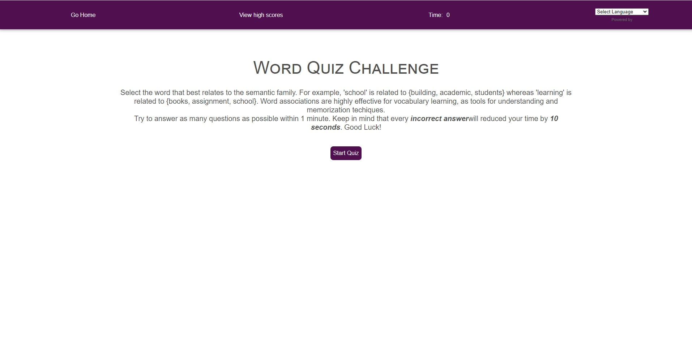
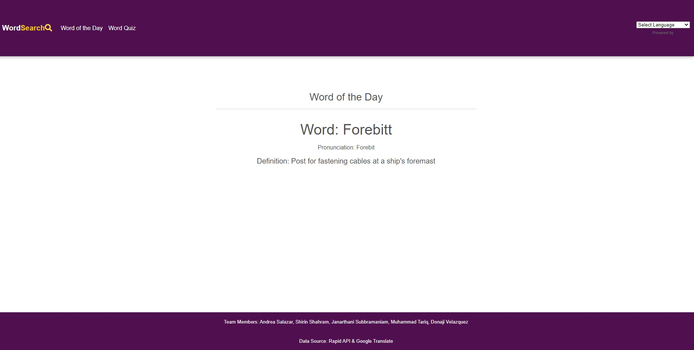

# Word Search APP

The main purpose of this project is to provide an easy-to-navigate platform that enables users to search for different words and find their definition, references and examples. This project also features “word of the day”, “word quiz”, “webpage translation” and saving favorite words.

## User Story

As a student, I want to search and learn different words, so that I can  be better prepared for my english courses.

## Acceptance Criteria

1. When I open the website, then a search box is displayed for searching a word.
2. When I search a word, then definition, references and examples for that specific word should be displayed.
3. When I click on ♡ symbol next to the searched word, then the word should be saved and be shown under favorite section.
3. When I click on the "Word of the Day" tab, then I am presented with a random word for that day.
4. When I click on the "Word Quiz" tab, then I will be redirected to another page to take a fun word quiz.
5. When I click on translation drop down menu, then I should be able to select the language and the whole page will be translated in the selected language.

## Live URL

Please find the website deployed here - [(https://vsjanarthani.github.io/word-search/)]

## Project Repository

Please find the project repository here - [(https://github.com/vsjanarthani/word-search)]

## Built With

* HTML
* CSS
* JavaScript

## Screenshot of the Deployed Webpage
* Word Search (Main Page)

* Word Quiz

* Word of the Day

## Contribution

* Janarthani Subbramaniam
* Shirin Shahram
* Donaji Velazquez
* Andrea Salazar
* Muhammad Tariq

Made with :heart: by **Team**